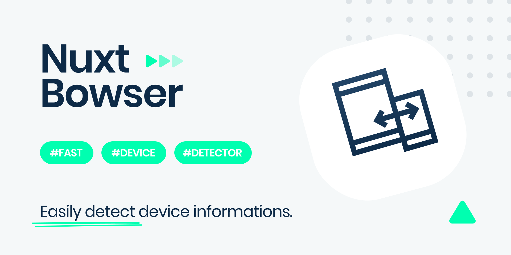

<p align="center">
    
</p>

<h1>Nuxt Bowser</h1>

Bowser module for Nuxt.js.

## Features

- Helps you integrate `browser/platform/engine` detector
- Provides a `lightweight`, `fast` and `rich-API` solution (~5kB/min+gz) 🔥
- Allows you to access the module globally by using `this.$browser`
- Automatically updates the `html` tag with the appropriate values based on the device info
- Super-easy to use without complicated configurations ✨
- Supports options for `additional` customization
- `Zero-config` setup ready to go 🚀

## Quick Start

1. Add `nuxt-bowser` dependency to your project

```bash
$ npm install --save-dev nuxt-bowser # or yarn add --dev nuxt-bowser
```

2. Add `nuxt-bowser` to the `buildModules` section of `nuxt.config.js`

```js
// nuxt.config.js

export default {
  buildModules: ['nuxt-bowser'],

  bowser: {
    /* module options */
  }
}
```

That's it! Start developing your app ✨

## Examples

💻 Here are some code examples

- [Basic](https://github.com/ivodolenc/nuxt-bowser/tree/master/examples/basic)
- [Global Name](https://github.com/ivodolenc/nuxt-bowser/tree/master/examples/global-name)
- [Auto Detect](https://github.com/ivodolenc/nuxt-bowser/tree/master/examples/auto-detect)

### Basic usage

```html
<!-- index.vue -->

<template>
  <section>
    <div v-if="$browser.is('mobile')">
      <h3>Mobile</h3>
    </div>
    <div v-else-if="$browser.is('tablet')">
      <h3>Tablet</h3>
    </div>
    <div v-else-if="$browser.is('desktop')">
      <h3>Desktop</h3>
    </div>
    <div v-else-if="$browser.is('tv')">
      <h3>TV</h3>
    </div>
    <div v-else>
      <h3>Other</h3>
    </div>
  </section>
</template>
```

### Get Platform

```js
console.log(this.$browser.getPlatform())

// Outputs
{
  type: 'desktop',
  vendor: 'Apple'
}
```

### Get OS

```js
console.log(this.$browser.getOS())

// Outputs
{
  name: "macOS",
  version: "10.15.7",
  versionName: "Catalina"
}
```

### Get Browser

```js
console.log(this.$browser.getBrowser())

// Outputs
{
  name: 'Chrome',
  version: '91.0.4472.77'
}
```

### Get Engine

```js
console.log(this.$browser.getEngine())

// Outputs
{
  name: 'Blink'
}
```

### Get Result

```js
console.log(this.$browser.getResult())

// Outputs
{
  browser: {
    name: 'Chrome',
    version: '91.0.4472.77'
  },
  engine: {
    name: 'Blink'
  },
  os: {
    name: 'macOS',
    version: '10.15.7',
    versionName: 'Catalina'
  },
  platform: {
    type: 'desktop',
    vendor: 'Apple'
  }
}
```

### Is Anything

Check if the `browser` is called `anything`, the `OS` called `anything` or the `platform` called `anything`

```js
console.log(this.$browser.is('mobile')) // false
console.log(this.$browser.is('desktop')) // true
console.log(this.$browser.is('tv')) // false
console.log(this.$browser.is('chrome')) // true
console.log(this.$browser.is('firefox')) // false
console.log(this.$browser.is('safari')) // false
console.log(this.$browser.is('macos')) // true

// ...
```

**Full list**

```js
// Is Platform
this.$browser.is('mobile')
this.$browser.is('tablet')
this.$browser.is('desktop')
this.$browser.is('tv')

// Is OS
this.$browser.is('windowsphone')
this.$browser.is('windows')
this.$browser.is('macos')
this.$browser.is('ios')
this.$browser.is('android')
this.$browser.is('webos')
this.$browser.is('blackberry')
this.$browser.is('bada')
this.$browser.is('tizen')
this.$browser.is('linux')
this.$browser.is('chromeos')
this.$browser.is('playstation4')
this.$browser.is('roku')

// Is Browser
this.$browser.is('amazon_silk')
this.$browser.is('android')
this.$browser.is('bada')
this.$browser.is('blackberry')
this.$browser.is('chrome')
this.$browser.is('chromium')
this.$browser.is('electron')
this.$browser.is('epiphany')
this.$browser.is('firefox')
this.$browser.is('focus')
this.$browser.is('generic')
this.$browser.is('googlebot')
this.$browser.is('google_search')
this.$browser.is('ie')
this.$browser.is('k_meleon')
this.$browser.is('maxthon')
this.$browser.is('edge')
this.$browser.is('mz')
this.$browser.is('naver')
this.$browser.is('opera')
this.$browser.is('opera_coast')
this.$browser.is('phantomjs')
this.$browser.is('puffin')
this.$browser.is('qupzilla')
this.$browser.is('qq')
this.$browser.is('qqlite')
this.$browser.is('safari')
this.$browser.is('sailfish')
this.$browser.is('samsung_internet')
this.$browser.is('seamonkey')
this.$browser.is('sleipnir')
this.$browser.is('swing')
this.$browser.is('tizen')
this.$browser.is('uc')
this.$browser.is('vivaldi')
this.$browser.is('webos')
this.$browser.is('wechat')
this.$browser.is('yandex')

// Is Engine
this.$browser.isEngine('edgehtml')
this.$browser.isEngine('blink')
this.$browser.isEngine('trident')
this.$browser.isEngine('presto')
this.$browser.isEngine('gecko')
this.$browser.isEngine('webkit')
```

## Bowser API

```js
// Get Platform
this.$browser.getPlatform()
this.$browser.getPlatformType()

// Get OS
this.$browser.getOS()
this.$browser.getOSName()
this.$browser.getOSVersion()

// Get Browser
this.$browser.getBrowser()
this.$browser.getBrowserName()
this.$browser.getBrowserVersion()

// Get Engine
this.$browser.getEngine()
this.$browser.getEngineName()

// Get Result
this.$browser.getResult()

// Get UserAgent
this.$browser.getUA()

// Is Anything
this.$browser.is(anything, includingAlias)

// Is Platform
this.$browser.isPlatform(platformType)

// Is OS
this.$browser.isOS(osName)

// Is Browser
this.$browser.isBrowser(browserName, includingAlias)

// Is Engine
this.$browser.isEngine(engineName)
```

[More info](https://lancedikson.github.io/bowser/docs/index.html)

## Options

**Default options**

```js
// nuxt.config.js

{
  bowser: {
    name: 'browser',
    autoDetect: false,
    userAgent: 'Mozilla/5.0 (Macintosh; Intel Mac OS X 11_4) AppleWebKit/537.36 (KHTML, like Gecko) Chrome/91.0.4472.77 Safari/537.36'
  }
}
```

### name

- Default: `browser`

Allows you to `customize` the global module name.

```js
// nuxt.config.js

{
  bowser: {
    name: 'browser',
  }
}
```

**Available globally**

```js
// Access the module by using
this.$browser

// or
const browser = this.$browser
```

**Additional customization (optional)**

For example, you can set it to `'device'` or any other name that suits you best.

```js
// nuxt.config.js

{
  bowser: {
    name: 'device', // Define the option according to your needs
  }
}
```

**Available globally**

```js
// Access the module by using
this.$device

// or
const device = this.$device

// Example
this.$device.getBrowser()
this.$device.is('chrome')
this.$device.isEngine('blink')
```

```html
<!-- Example ($device) - index.vue -->
<template>
  <div>
    <h3 v-if="$device.is('mobile')">Mobile</h3>
    <h3 v-else-if="$device.is('tablet')">Tablet</h3>
    <h3 v-else>Desktop</h3>
  </div>
</template>
```

### autoDetect

- Default: `false`

Automatically inserts a custom `data-browser` attribute into the `html` tag with the appropriate values based on the detected device informations such as `operating system`, `browser name` and `platform type`.

This can be very useful if you need to set style for specific cases.

```js
// nuxt.config.js

{
  bowser: {
    autoDetect: true,
  }
}
```

**Outputs**

```html
<html data-browser="macos chrome desktop"></html>
```

**Example (custom styling for `chrome` & `mobile` devices)**

```css
/* main.css  */

html[data-browser*='chrome mobile'] {
  background-color: blue;
}
```

**Example (custom styling for `desktop` device)**

```css
/* main.css  */

html[data-browser*='desktop'] {
  background-color: green;
}
```

**Additional customization (optional)**

Also, you can customize `attribute name` or specify a custom `prefix` for the detected `values`.

```js
// nuxt.config.js

{
  bowser: {
    autoDetect: {
      attributeName: 'data-device',
      valuePrefix: 'is-'
    },
  }
}
```

**Outputs**

```html
<html data-device="is-macos is-chrome is-desktop"></html>
```

**Example**

```css
/* main.css  */

html[data-device*='is-desktop'] {
  background-color: green;
}
```

### userAgent

Default `userAgent` fallback for Nuxt `static` target (`nuxt generate`).

```js
// nuxt.config.js

{
  bowser: {
    userAgent: 'Mozilla/5.0 (Macintosh; Intel Mac OS X 11_4) AppleWebKit/537.36 (KHTML, like Gecko) Chrome/91.0.4472.77 Safari/537.36'
  }
}
```

## License

**Bowser**

[MIT License](https://github.com/lancedikson/bowser/blob/master/LICENSE)

Copyright (c) Bowser

**Nuxt Bowser Module**

[MIT License](LICENSE)

Copyright (c) Ivo Dolenc
